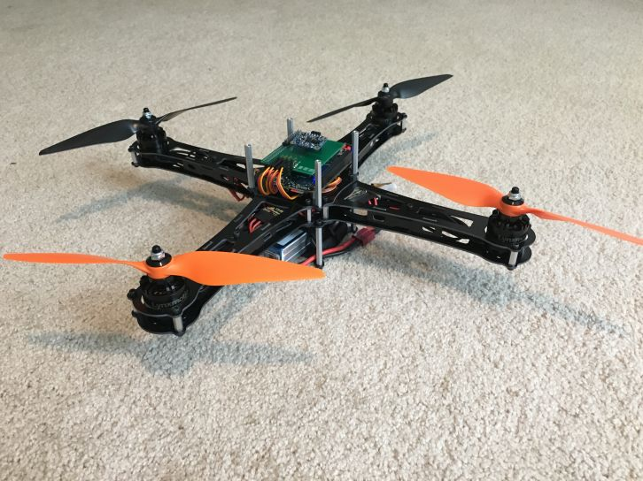

# flyer
This is my drone project where I am attempting the flight controls from a BeagleBone Black Wireless.

## More Info
* PWM and IMU interface drives are done by me and use Linux Sysfs.
* Made a quick PCB to connect motors, power, and IMU to BBB connection headers.
* I communicate with the drone over WiFi with SSH.
